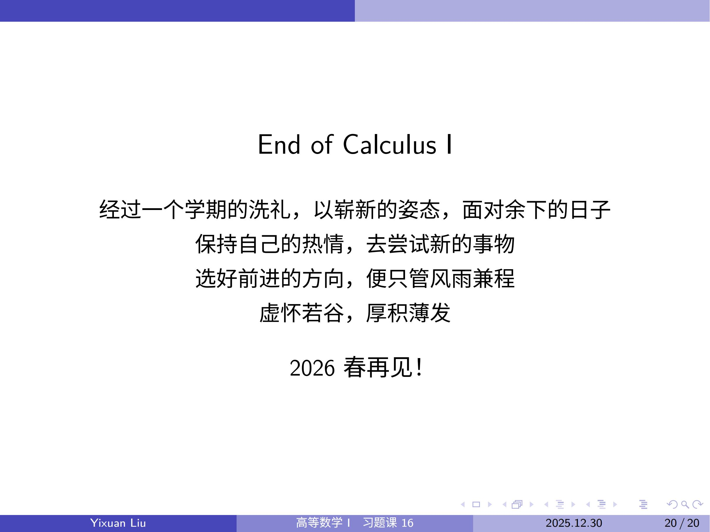

> 这篇文档是为Coursebench上高等数学I 课程所写的评价。链接：https://coursebench.geekpie.club/course/927?answer=2068

# 我与高等数学I的三年

> 利益相关：23秋 / A+； 24春 / A； 25春TA (Volunteer)； 25秋TA（王强老师班）
>
> 本人25秋作为TA所自行编辑的课程资料全部在[GitHub Repo](https://github.com/Reversion2027/ShanghaiTech_Calculus1_25Fall_Recitations)公开，希望能对大家有所帮助（如果觉得有用可以点个star支持一下）。
>
> ~~标题reference：[1] *我与CS101的三年*，wts233, [链接](https://coursebench.geekpie.club/course/347?answer=1572)~~

## 总记
高等数学I，大多数同学大学数学学习的第一步。它很难：需要在16周的时间内，学习放在高中几乎要花一整个学年学习的内容；课程的知识体系比起初等数学，要更难以熟悉，且在语言表述习惯上有明显的区别（从三点式的因为与所以符号转向多样化的文字表述、量词的大量使用）；对证明过程的严谨性有明显更高的要求，且要求对“无穷”有足够好的理解与认识。本人刚入学时也一样感到不知所措，上课听不懂，作业写不出，quiz答不了基本是前几周的常态，好在及时找到了适合自己的学习方法，并适应了高数的节奏，才有幸成为高数I的课程助教。本篇评论将从本人大一入学开始，简单记载自己所经历的有关事件，并提供一些个人的学习方法。有点长，但有小标题，不愿意花时间读全文可以直接通过小标题略读。

注：虽然本文是关于高数I的评论，但是应当对高数II的学习也有借鉴意义。

## 作为学生（23\~24学年）

### 课程内容

截至25春学期，高数课程使用的都是交大教材《大学数学 微积分》（第二版 / 第三版），学期的教学内容与教材的分册稍有变动：高数I包含第1\~5章的内容，以及课本下册最后一章-级数；高数II则包含剩余所有内容，从微分方程讲起，到曲线与曲面积分结束（23\~24学年及以前的高数是和教材分册完全一样的，此改动发生在24\~25学年）。

### 适应期：选好老师，找到自己的节奏

本人在学期初的时候在朱佐农老师班上，虽然朱老师讲得很好，但是于还在适应学习进度的我而言，还是有些太快了；某一天下课后，我前往陈浩老师班上旁听，发现讲得要慢一些，也更加细致一些，于是便换了班。**大家评价好、公认的好老师未必是最适合你的老师**（但是有更大的概率是），在开学后的调课窗口期，如果发现自己无法适应当前老师的节奏，要及时去旁听其他老师的课，找到一位最适合自己的老师，然后在选课系统中进行换班。

选好老师以后，找到自己的节奏也同样重要。在这里贴一段数所老师的话：

> 从中学到大学的过渡对很多同学来说都不是一件容易的事。我们会用这样的比喻，在中学时老师用调羹喂学生，大学刚开始时老师为学生夹菜，后来是学生自己去夹菜，再后来就是学生学会做简单的饭菜来喂饱自己了。

开学初期，需要逐步适应新的学习状态。最开始听不明白的时候可以**尽量多到课、课后多练多问**（完全是可以去问老师的，目前看来老师们都很愿意提供帮助，不好意思问老师也可以问助教），慢慢地度过刚开学的适应期，等到逐渐适应了学习的节奏以后就可以开始以自己的方式进行学习了。

除此以外，推荐尽早观看3b1b的[微积分的本质](https://www.bilibili.com/video/BV1qW411N7FU/?spm_id_from=333.337.search-card.all.click&vd_source=1d90f420189e5c1e0802bb5576518f79)系列视频，以建立起比较好的几何直观。

### 平时练习：搞懂课本例题，认真完成作业，利用小测自查

课本例题是理解知识点非常重要的途径之一，老师上课讲解的题目也多半来源于课本例题，有些时候上课的内容也就是把课本的例题再重新拿出来一步一步地进行讲解。如果有课前预习的习惯，可以先尝试理解课本上所包含的定义、定理、例题，上课时就是进行第二遍学习了，理解起来会方便很多；没有预习的习惯也影响不大，上课或看课本自学遇到的困难也都可以找老师或助教提问得到答案。

高数I的部分作业批改仅看**完成度**（除ε-δ语言对应作业批改较为细致），为了正确率而去不经思考地拍照搜题、抄答案是不可取的。作业考察更类似一种过程性的检查，确保大家有正常完成作业，帮助大家进行课后的辅助练习来强化对内容的理解、进行查漏补缺。考虑到作业批改的问题（作业量还是偏大的，老师与助教一般没有那么多时间去细细批改每一位同学作业中的每一个细节），完成作业以后最好是自己对一下课本后附的参考答案，或在老师发布作业答案后对照批改，查漏补缺。

课程设置的Quiz虽然在最终总评分内有占比，但其主要作用是帮助大家进行学习情况的自测，通过Quiz作答的正确率来检查自己在过去的一个/两个章节中的学习是否有明显的缺漏。本人在24春修读高数II的时候，前两次Quiz分别拿了4分、5分（满分10分），但在Quiz之后及时地进行了查漏补缺，因此最后知识点掌握得还算不错（虽然期中还是有点小崩）。

### 考前练习：适当进行练习，切忌过拟合

每年期中末考前，教学团队都会发放模拟卷/练习卷以帮助大家复习，每个教学班发放的情况可能有所不同，如果需要更多资源要去主动寻找或与其他班的同学交流。一般来讲，3套练习卷足够完成所有考试内容的查漏补缺工作，额外的练习需要量力而行，收益可能远不如针对已完成的练习卷进行订正。23年、24年练习卷是不发布答案的，可能要做到这一点较为困难，但是25秋~~既发布了答案又有评讲课~~，在有条件的情况下，应该做的事情是复习错题而非刷新题。

本人在23秋的策略是：做完所有练习卷，自行上网寻找交大往年考卷，不确定的题与老师邮件约Office Hour进行答疑。鉴于高数教学已由上科大独立负责，交大往年卷在题型风格和考察侧重上可能与现在有所不同，但依然是检测基础知识的绝佳材料，因此可以根据个人需求进行选择性地练习。

## 作为助教（25春、25秋）

25春作为Volunteer，其实没有做实质性的工作。主要总结一下25秋的工作：

* 12节课纲内习题课（除1、3、10、16四周）
* 3节课纲外习题课（10期中复习、16级数、17期末复习）
* 往年期中考卷答案 ~~期末被ddl爆了没时间写~~
* 习题课slides与期中期末复习slides
  * 以上两份资料均可在本文开头的GitHub链接中找到
* 期末卷讲解录播 ~~太好了明年还当助教的话就不用讲了~~

### 教学内容

#### 正课

25秋的正课教学内容发生了些许变化，开学时花了不小的篇幅讲解数学证明的思路（包括习题课也专门有一节讲解证明），以及对于第一章-集合与函数的讲解更加细致。我个人认为这样的改动对于帮助大家适应大学的学习节奏是非常有效的（不知道实际上大家的体验如何），但也带来了一个新的挑战：由于前期铺垫详尽，留给后半学期级数与积分的时间相对紧凑，这对大家的课后消化能力提出了更高的要求，需要花更多的时间在课外进行练习来夯实基础。不过总体来讲，本学期的正课教学质量还是在线的，课堂的出勤率也出奇得高（从来没见过期末了还能几乎坐满的课程）。

#### 习题课

本人这学期的习题课主要关注以下内容：

* 几何直观理解。高等数学I、II的课程内容，几乎全都可以找到几何上对应的例子，以我的个人经验，如果能从几何上理解各种定理、公式，那么对这些知识的运用将能够更加融会贯通。本人在这方面做出的努力包括W4\~W6极限的几何理解、W8\~W9导数的多种理解方式、W11微分中值定理的几何理解等等。
* 证明思路的构建。大家做证明题的常见问题是“不敢动手”或者“不会动手”，找不到思路，难以从题目条件中获取信息。因此，在习题课上讲解证明题的时候，本人努力尝试了进行证明思路构建的引导，并试图传输“当你不知道能做点什么的时候，随便做点什么”和“尝试很可能是错误的，要进行多种尝试，发现错误及时回头”的两个观念（来源于陈浩老师）。
* “无穷”的理解。虽然提得不多，但是在需要用到的地方，都进行了多次“无穷是一个过程量”的强调，这样的分析思路在极限、反常积分、级数中虽然不能说处处都能用到，但至少在部分问题辨析的过程中需要频繁地对无穷的概念进行定义化的拆解分析。
* 同学的听课体验。每次课后都会发放一份反馈问卷，调查对该节习题课涉及知识点的掌握程度、对课程速度，质量，氛围的评价等，整个学期总计收到了200余份填答，并尽力进行了课程质量的改善。

本人自知自己的习题课无法涵盖所有人的需求，事实上也无法做到让所有小班上的学生都能从习题课中受益；前半学期强调的各种直观理解，更多的利好的是基础相对较好的同学，这些理解或许可以提供一些新的思路与启发，但基础稍差一些的同学可能难以接受这些直观理解，因此最后收获可能也不太多。后半学期的直观理解较少，且积分的基本功十分重要，因此主要关注多种积分的技巧，试图提高大家积分的熟练度，尝试帮助基础较为薄弱的同学更顺利地通过积分这一难点。

总的来讲，这学期第一次正式地做一门课程的助教，做出了许多尝试与改进，对自己的付出还算满意。也感谢所有来听过我的习题课的同学对我的支持，教学是双向的，单有讲授者的讲述不足以构建良好的课堂，同学们在课上的积极反馈给了我不小的继续努力下去的动力。最后贴一段在16周习题课上的结语：

祝大家学业顺利，2026春再见！